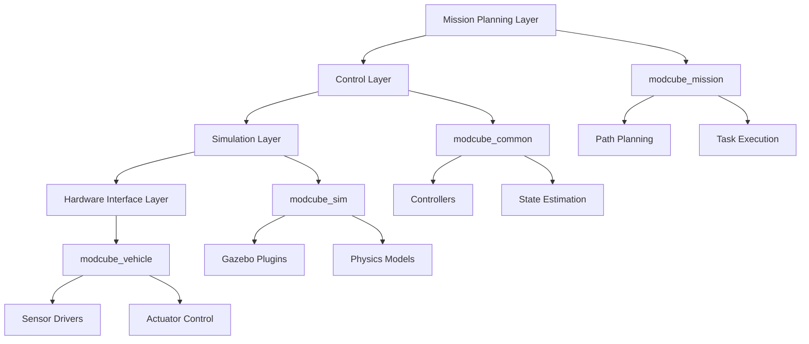

# RS-ModCubes: Self-Reconfigurable, Scalable Modular Cubic Robots for Underwater Operations

<div align="center">

[](http://wiki.ros.org/)
[](LICENSE)
[](https://github.com/your-repo/actions)
[](https://doi.org/10.1109/LRA.2025.3543139)

</div>

## Overview

**RS-ModCubes** is a comprehensive simulation, control, and mission planning framework for self-reconfigurable, scalable modular underwater robots. This system enables the simulation and control of multiple cubic robotic modules that can autonomously reconfigure to form different morphologies for various underwater operations.

### Key Features

- **Modular Self-Reconfiguration**: Dynamic morphology adaptation during missions
- **Underwater Physics Simulation**: Comprehensive hydrodynamic modeling with Gazebo
- **Mission Planning**: Autonomous navigation and task execution
- **Teleoperation Support**: Real-time human-robot interaction
- **Multi-Robot Coordination**: Scalable swarm behavior implementation
- **Extensible Framework**: Modular ROS-based architecture

### Links

- **Paper**: [RS-ModCubes: Self-Reconfigurable, Scalable Modular Cubic Robots for Underwater Operations](https://doi.org/10.1109/LRA.2025.3543139)
- **Project Website**: [https://jiaxi-zheng.github.io/ModCube.github.io](https://jiaxi-zheng.github.io/ModCube.github.io)
- **Base Framework**: [CMU TartanAUV Team](https://www.tartanauv.com/) (Kingfisher)

---

## Architecture Overview

The RS-ModCubes framework is built on a modular ROS-based architecture designed for scalability and flexibility:



## Package Structure

### Core Framework Packages

| Package | Description | Key Components |
|---------|-------------|----------------|
| **`modcube_common`** | Core utilities and shared libraries | Controllers, planners, state estimation, dynamics |
| **`modcube_config`** | Configuration files and robot descriptions | URDF models, parameter files, launch configurations |
| **`modcube_mission`** | Mission execution and teleoperation | Mission planning, teleop interface, system launch files |
| **`modcube_msgs`** | Custom ROS message definitions | Inter-module communication protocols |

### Simulation Packages

| Package | Description | Key Components |
|---------|-------------|----------------|
| **`modcube_sim`** | Gazebo simulation interface | Simulation launch files, environment setup |
| **`modcube_sim_gazebo_plugins`** | Custom Gazebo plugins | Thruster dynamics, navigation state, sensor models |
| **`modcube_sim_worlds`** | Simulation environments | Underwater worlds, obstacle courses, test scenarios |

### Hardware Interface

| Package | Description | Key Components |
|---------|-------------|----------------|
| **`modcube_vehicle`** | Vehicle-specific hardware drivers | IMU, thrusters, sensors, actuator control |

### Dependencies

| Package | Description | Key Components |
|---------|-------------|----------------|
| **`uuv_simulator`** | UUV simulation framework | Hydrodynamic models, sensor plugins, control algorithms |

---

## Quick Start

### Prerequisites

```bash
# Required ROS distribution
ROS Melodic or Noetic

# Dependencies
sudo apt-get install ros-$ROS_DISTRO-gazebo-*
sudo apt-get install ros-$ROS_DISTRO-uuv-simulator
```

### Installation

```bash
# Clone the repository
git clone https://github.com/your-username/ModCube.git
cd ModCube

# Build the workspace
catkin build

# Source the workspace
source devel/setup.bash
```

### Running the Simulation

#### 1. Launch Simulation Environment

```bash
# Start the basic simulation
roslaunch modcube_sim kingfisher_umd_sim.launch

# For multi-robot simulation
roslaunch modcube_sim multi_robot_sim.launch num_robots:=4
```

#### 2. Launch Mission System

```bash
# Start teleoperation interface
roslaunch modcube_mission teleop_mission.launch

# Start autonomous mission
roslaunch modcube_mission autonomous_mission.launch mission_file:=sample_mission.yaml
```

#### 3. Send Navigation Commands

```bash
# Set navigation goal (position + orientation quaternion)
rostopic pub /modcube/goto geometry_msgs/PoseStamped "
header:
  frame_id: 'world'
pose:
  position: {x: 2.0, y: 2.0, z: 2.0}
  orientation: {x: 0.0, y: 0.0, z: 0.0, w: 1.0}"

# Or use the simplified command interface
goto 2 2 2 1 1 1 1
```

---

## Advanced Usage

### Custom Robot Configurations

Create custom robot configurations by modifying URDF files:

```bash
# Edit robot description
roscd modcube_config/modcube_sim_description/urdf/
# Modify default.xacro for single robot
# Modify default_4_modcube.xacro for quad configuration
```

### Mission Planning

Define custom missions using YAML configuration:

```yaml
# sample_mission.yaml
mission:
  name: "exploration_mission"
  waypoints:
    - {x: 0, y: 0, z: 0}
    - {x: 5, y: 0, z: -2}
    - {x: 5, y: 5, z: -2}
  tasks:
    - type: "survey"
      duration: 30
    - type: "sample_collection"
      target: "object_1"
```

### Control Parameters

Tune control parameters via ROS parameters:

```bash
# View current parameters
rosparam list /modcube/

# Set PID gains
rosparam set /modcube/controller/pid_gains/kp 1.0
rosparam set /modcube/controller/pid_gains/ki 0.1
rosparam set /modcube/controller/pid_gains/kd 0.01
```

---

## Testing and Validation

### Unit Tests

```bash
# Run all tests
catkin run_tests

# Run specific package tests
catkin run_tests modcube_common
```

### Simulation Validation

```bash
# Test basic functionality
rostest modcube_sim basic_simulation.test

# Test multi-robot scenarios
rostest modcube_sim multi_robot.test
```

---

## Performance Metrics

The framework has been validated with the following performance characteristics:

- **Real-time Factor**: 0.8-1.0 (depends on system configuration)
- **Control Frequency**: 50-100 Hz
- **Simulation Accuracy**: <5% error in hydrodynamic forces
- **Multi-robot Scalability**: Tested up to 8 robots simultaneously

---

### Code Style

- Follow ROS C++ Style Guide
- Use `clang-format` for code formatting
- Include comprehensive unit tests
- Document public APIs with Doxygen

---

## Citation

If you use RS-ModCubes in your research, please cite our work:

```bibtex
@article{zheng2025rs,
  title={Rs-modcubes: Self-reconfigurable, scalable, modular cubic robots for underwater operations},
  author={Zheng, Jiaxi and Dai, Guangmin and He, Botao and Mu, Zhaoyang and Meng, Zhaochen and Zhang, Tianyi and Zhi, Weiming and Fan, Dixia},
  journal={IEEE Robotics and Automation Letters},
  year={2025},
  publisher={IEEE}
}
```

---

## License

This project is licensed under the MIT License - see the [LICENSE](LICENSE) file for details.

---

## Acknowledgments

### Acknowledgments
- CMU TartanAUV Team for the foundational Kingfisher framework
- UUV Simulator community for the underwater simulation tools
- ROS community for the robotics middleware

---

## Related Projects

- [UUV Simulator](https://github.com/uuvsimulator/uuv_simulator)
- [TartanAUV](https://www.tartanauv.com/)
- [ROS](https://www.ros.org/)
- [Gazebo](http://gazebosim.org/)

---

<div align="center">

**If you find this project useful, please consider giving it a star!**

</div>
